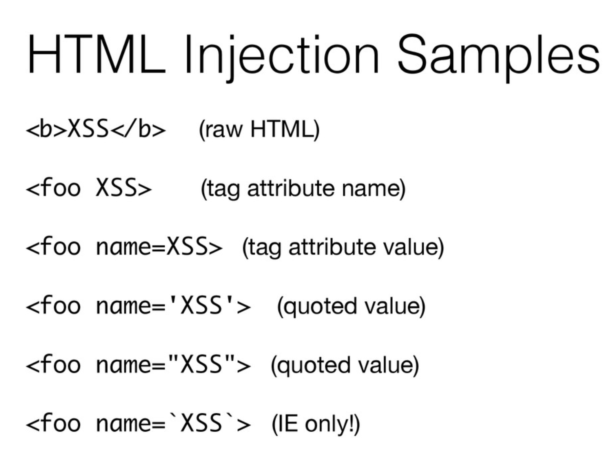
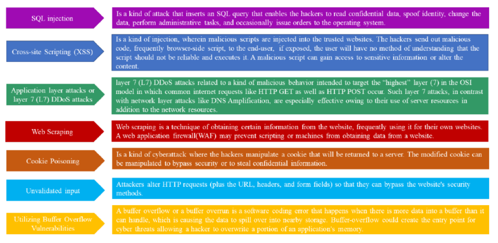

# WAFFLE

## Introduction
Probably you know about CloudFlare, every one knows, but this is a partially paid solution. As the open source community
we are missing a real modular and open source **Web Application Firewall** that could be used in the place of CF.

## How to run / Develop ?

### Prerequisites 
+ Go 1.22
+ golangci-lint
+ make (if windows, try using chocolatey)
+ openssl (if windows, try using git bash)

1. Create certificates and FS embed go file provider `make certs_windows`
2. Execute `docker compose up -d` to create needed infrastructure
3. Set environment variables before running the proxy:

### Generate certificates
Execute make certs_windows and go through process. It should certs in the .cert directory.

## Planned features / Architecture
To bo honest, I'm learning how to write WAF from the scratch, so this part will be updated after a while. 

- [X] XSS protection (HTML + we can take a look on sql injection)
- [ ] DDOS protection

## Education

### XSS
There are two types of XSS:
+ HTML injection
+ JS injection (can be validated only on the client side, so for now let's stick to the developers 😁)

**HTML injection**
> HTML injection are attacks agains the HTML tokenization algorithm, examples:

> Basically, we need to tokenize input and check attributes, tags against a set of rules

Links:
+ [A Comprehensive Examination of Cloudflare's IP-based Distributed Denial of Service Mitigation](https://www.researchgate.net/publication/375238537_A_Comprehensive_Examination_of_Cloudflare%27s_IP-based_Distributed_Denial_of_Service_Mitigation)
+ [A Brief Study on The Evolution of Next Generation Firewall and Web Application Firewall](https://www.researchgate.net/publication/351637754_A_Brief_Study_on_The_Evolution_of_Next_Generation_Firewall_and_Web_Application_Firewall)
+ [SWAP: Mitigating XSS Attacks using a Reverse Proxy](https://sites.cs.ucsb.edu/~chris/research/doc/sess09_swap.pdf)
+ 
